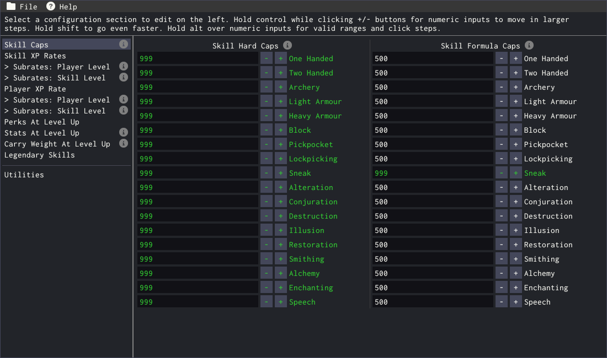
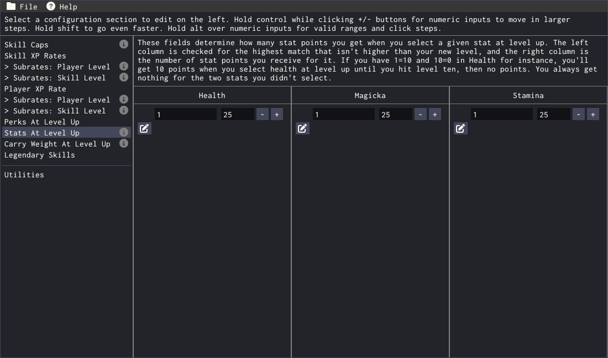
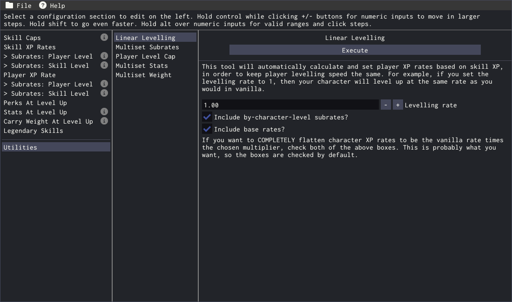

# Skyrim Skill Uncapper Assistant

There's a [fantastic skyrim mod](https://www.nexusmods.com/skyrimspecialedition/mods/46536) (which has been around since before Special Edition was even a thing) that allows you to fine-tune all sorts of things about your skills and experience rates in Skyrim. You can set skill level caps for each skill, adjust the cap that's used in calculations, tweak experience rates for the skills and for your character, control how many perk points you gain at level up, and more.

The problem is that all of that is a _lot_ to configure. And it's just a raw text file, too. And _that's_ just to set things to arbitrary numbers - what if you want to, say, level your skills faster or slower than vanilla, on a curve so the rate changes over time, while keeping your character experience rate the same as vanilla? You'll have to do a bunch of maths to keep your character level rate the same, edit _dozens_ of different sections to create the curve, and over a dozen _just_ to change your skill experience rate. It's a lot of work.

Enter the Skill Uncapper Assistant.

This project provides a graphical interface to edit the Skill Uncapper mod's configuration file, so you don't have to edit dozens and dozens of sections by hand. And more than that, it includes a handful of automatic tools to do all of those calculations for you, at the click of a button!

## Examples

Single-field values (where there's only one input field, rather than a list of paired ones) will be green when the value matches the default for the mod, yellow when you've changed the value since you saved/loaded your settings, and white otherwise. Multi-field values unfortunately do not do this at this time.

## Installation

Download the `Release.zip` from the [latest release](https://github.com/PrincessRTFM/SkyrimUncapperConfigTool/releases/latest) and unzip it to an empty folder. To run the tool, launch the `SSEUncapConfig.exe` file. You will be asked to locate your `SkyrimUncapper.ini` file, after which you will not need to do so again unless you move the file or delete the `SSEUncapConfig.ini` file from your installation folder.

## Usage

When you start the utility, it will automatically load your `SkyrimUncapper.ini` file, provided it can find it. If you've installed Skyrim to the default location and the mod directly into your Skyrim installation folder, then it'll be discovered automatically on first launch.

In the File menu, you can reload your config file (which will discard all changes you've made), reset _everything_ to the default, and save your changes into the config file. The settings file on your drive is not touched until you save your changes here.

